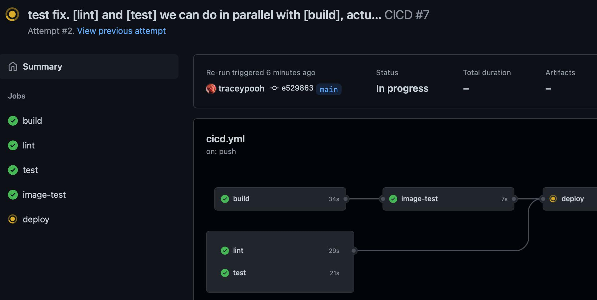

# HinD demo repository

Repo that does end-to-end full CI/CD pipelines to a
["HinD"](https://github.com/internetarchive/hind)
Hashistack-in-Docker cluster.

We'll use our baseline
["hello-js"](https://github.com/internetarchive/hello-js)
repo, which uses GitHub Actions for a full CI/CD pipeline, with multiple custom test jobs (each using an arbitrary docker image).

See the main CI/CD config here:
- [.github/workflows/cicd.yml](.github/workflows/cicd.yml)

---
## Try it yourself
If you setup a HinD docker container on your own unix virtual machine / baremetal, you could fork/copy this reop to get started.

You'll simply need to update the
[cicd.yml](.github/workflows/cicd.yml)
values:
```yaml
BASE_DOMAIN: (wildcard DNS domain name, eg: example.com)
NOMAD_ADDR: (hostname of the VM where your HinD is running)
```
and
[create a secret](https://docs.github.com/en/actions/security-guides/encrypted-secrets#creating-encrypted-secrets-for-a-repository)
named `NOMAD_TOKEN` with the value from your HinD running container.


---
## Example pipeline:


